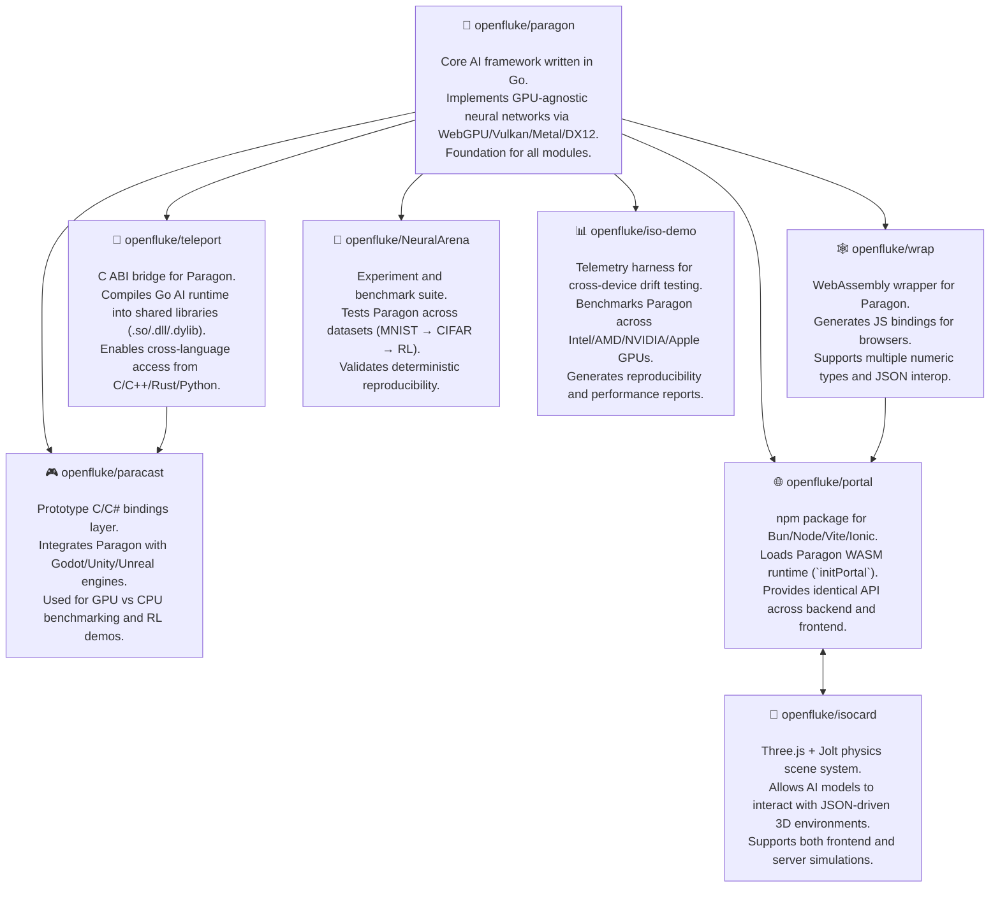

# 🧠 Paragon Ecosystem Overview

**Parallel Architecture for Resilient Adaptive Growth & Optimized Networks**

Welcome to the **OpenFluke Paragon Ecosystem** — a modular, isomorphic AI framework stack designed for reproducibility, cross-platform physics integration, and GPU-agnostic machine learning.

This repository documents all core components of the ecosystem, how they interconnect, and how Paragon’s Go AI runtime expands into multiple environments — from native C and Python bindings to WebGPU, WASM, and npm packages.

---

## 🌐 Core Philosophy

Paragon is built for **true portability**:

- Runs natively on **Go + WebGPU/Vulkan**
- Bridges into **C/C++/C#/Python**
- Compiles seamlessly to **WebAssembly**
- Runs the same neural network logic **across backend, frontend, and console** — without model conversion

The ecosystem enables experiments, AI training, and inference to coexist across desktop, browser, and mobile environments with identical results.

---

## 🧩 Repository Structure

### ✅ Core

| Repo                    | Description                                                                                                                                         | Link                                                                 |
| ----------------------- | --------------------------------------------------------------------------------------------------------------------------------------------------- | -------------------------------------------------------------------- |
| **`openfluke/paragon`** | The **Go AI core framework**. Houses Paragon’s neural network engine, GPU backends, and runtime API. Provides the foundation for all other modules. | [github.com/openfluke/paragon](https://github.com/openfluke/paragon) |

---

### ⚙️ Native Bridge Layer

| Repo                       | Description                                                                                                                                                                                                    | Link                                                                                                                                               |
| -------------------------- | -------------------------------------------------------------------------------------------------------------------------------------------------------------------------------------------------------------- | -------------------------------------------------------------------------------------------------------------------------------------------------- |
| **`openfluke/teleport`**   | **C ABI Bridge** — exposes Paragon’s internals as a C-compatible shared library (`.so`, `.dll`, `.dylib`) for cross-language integration.                                                                      | [github.com/openfluke/teleport](https://github.com/openfluke/teleport)                                                                             |
| **`openfluke/paracast`**   | Early prototype of the ABI bridge system — connects Paragon to **C/C++/C#**, powering integration with engines like **Godot, Unity, and Unreal**.                                                              | [github.com/openfluke/paracast](https://github.com/openfluke/paracast)                                                                             |
| **`openfluke/paragon-py`** | **Python bindings** for the Paragon runtime. Provides a pure-Python `ctypes` interface with prebuilt `.so/.dll/.dylib` binaries. Enables **train in Python → run in Go / WASM / C#** without model conversion. | [github.com/openfluke/paragon-py](https://github.com/openfluke/paragon-py)   [pypi.org/project/paragon-py](https://pypi.org/project/paragon-py) |

---

### 🕸️ Web & WASM Layer

| Repo                   | Description                                                                                                                                                      | Link                                                                                                                                                           |
| ---------------------- | ---------------------------------------------------------------------------------------------------------------------------------------------------------------- | -------------------------------------------------------------------------------------------------------------------------------------------------------------- |
| **`openfluke/wrap`**   | **WASM Wrapper Generator** — uses Paragon’s introspection system to automatically generate JavaScript bindings. Produces a browser-ready WebAssembly runtime.    | [github.com/openfluke/wrap](https://github.com/openfluke/wrap)                                                                                                 |
| **`openfluke/portal`** | **npm package & frontend bridge**. Wraps Paragon’s WASM output from `wrap` into an npm-installable bundle usable in **Bun**, **Vite**, **Ionic**, and **React**. | [github.com/openfluke/portal](https://github.com/openfluke/portal)   [npmjs.com/package/@openfluke/portal](https://www.npmjs.com/package/@openfluke/portal) |

---

### 🧪 Research & Experiment Layer

| Repo                        | Description                                                                                                                                                                                                    | Link                                                                                                                                                                        |
| --------------------------- | -------------------------------------------------------------------------------------------------------------------------------------------------------------------------------------------------------------- | --------------------------------------------------------------------------------------------------------------------------------------------------------------------------- |
| **`openfluke/NeuralArena`** | **Experiment harness and benchmark suite** for testing Paragon’s AI runtime. Contains Level-1→10 tasks (MNIST, CIFAR, NLP, RL, etc.), telemetry systems, and reproducibility tests.                            | [github.com/openfluke/NeuralArena](https://github.com/openfluke/NeuralArena)                                                                                                |
| **`openfluke/iso-demo`**    | **Cross-Device Inference Telemetry Harness** — tests Paragon’s reproducibility across **Intel, AMD, NVIDIA, and Apple GPUs** using CPU vs GPU drift benchmarks. Generates detailed telemetry reports and PDFs. | [github.com/openfluke/iso-demo](https://github.com/openfluke/iso-demo)   📄 [Telemetry Report v0.1.0 Release](https://github.com/openfluke/iso-demo/releases/tag/v0.1.0) |

> The telemetry system (`iso-demo`) collects and merges real-world performance and drift data across GPU vendors, verifying **bit-level determinism** of Paragon’s AI runtime.  
> See [`telemetry_report_merged.pdf`](https://github.com/openfluke/iso-demo/releases/tag/v0.1.0) for a full multi-device analysis — the first open, vendor-comparison audit of GPU-agnostic AI inference.

---

## 🧭 Ecosystem Dependency Diagram

---

## 🧱 Layered Architecture

| Layer            | Purpose                                                     | Technologies             |
| ---------------- | ----------------------------------------------------------- | ------------------------ |
| **1️⃣ Core**      | Neural network runtime, GPU kernels, AI model definition    | Go, WebGPU, Vulkan       |
| **2️⃣ ABI**       | Language-agnostic bridging (C, C#, Python)                  | CGO, C ABI               |
| **3️⃣ WASM**      | WebAssembly runtime for browser/JS                          | Go → wasm_exec.js        |
| **4️⃣ Frontend**  | npm distribution + web app integration                      | Vite, Bun, Ionic         |
| **5️⃣ Research**  | Datasets, benchmarks, drift validation                      | Python, Paragon bindings |
| **6️⃣ Telemetry** | Cross-device reproducibility testing, vendor drift analysis | Go, JSON, Python reports |

---

## 🧠 Key Capabilities

- GPU-agnostic: runs on Vulkan, Metal, GL, D3D12
- Same binary logic across Go, C, Python, and WebAssembly
- Deterministic neural network evaluation
- No Python-only dependencies (pure Go GPU kernels)
- Works both **headless (server)** and **interactive (browser)**
- Real-world drift validation and reproducibility metrics via **iso-demo telemetry reports**

---

## 📦 Future Additions

- **`openfluke/paragon-py`** — Official **Python binding** for Paragon (available on [PyPI](https://pypi.org/project/paragon-py/)).  
  Allows researchers to train or evaluate models in Python and run them natively in Go, C, or WebGPU — identical outputs, zero conversions.
- **`openfluke/gogoportal`** — Experimental Godot extension
- **`openfluke/primecraft`** — Sandbox + UGC game layer for AI-driven physics and player-training data collection

---

## 🧩 Contributing

1. Clone any repo and follow its README.
2. Report GPU driver quirks, reproducibility drifts, or ABI build issues.
3. Join the mission to make **AI reproducible, portable, and open-source**.

---

## 🔗 Links

- 🌍 Website: [https://openfluke.com](https://openfluke.com)
- 🧠 Core Framework: [github.com/openfluke/paragon](https://github.com/openfluke/paragon)
- 🧩 Docs: [github.com/openfluke/paragon_ecosystem](https://github.com/openfluke/paragon_ecosystem)
- 🧱 PyPI (coming soon): `paragon-py`
- 📦 npm: [`@openfluke/portal`](https://www.npmjs.com/package/@openfluke/portal)
- 🧾 Telemetry Harness: [github.com/openfluke/iso-demo](https://github.com/openfluke/iso-demo)
- 📑 [Telemetry Report v0.1.0](https://github.com/openfluke/iso-demo/releases/tag/v0.1.0)

---

### ⚡ License

All projects under the **OpenFluke** ecosystem are released under the **Apache-2.0 License**.

---

> _“Build once. Run everywhere. Reproduce everything.”_
> — Samuel Watson
