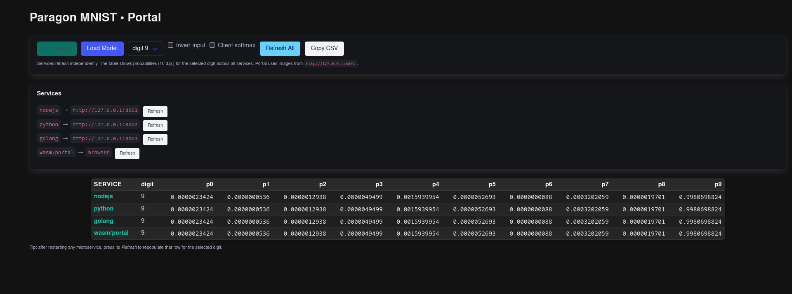

# 🧠 Paragon Ecosystem Overview

**Parallel Architecture for Resilient Adaptive Growth & Optimized Networks**

Welcome to the **OpenFluke Paragon Ecosystem** — a modular, isomorphic AI framework stack designed for reproducibility, cross-platform physics integration, and GPU-agnostic machine learning.

This repository documents all core components of the ecosystem, how they interconnect, and how Paragon’s Go AI runtime expands into multiple environments — from native C and Python bindings to WebGPU, WASM, and npm packages.

---

### 🧠 Capability Radar — Current Progress vs Target 2026


The chart above visualizes **Paragon’s current maturity** across its multi-domain AI competencies, benchmarked against the **2026 ecosystem targets**.

| Capability Area             | 2025 Progress | 2026 Target | Description                                                                                                                   |
| --------------------------- | ------------- | ----------- | ----------------------------------------------------------------------------------------------------------------------------- |
| **Vision**                  | 4 / 10        | 7 / 10      | Image, camera, and synthetic scene integration through physics-based rendering and differentiable perception models.          |
| **Text / NLP**              | 4 / 10        | 6 / 10      | Foundation for symbolic reasoning, semantic parsing, and lightweight instruction models embedded into Go and WebGPU runtimes. |
| **Tabular / Data**          | 5 / 10        | 6 / 10      | Deterministic numerical pipelines for CSV/JSON datasets with GPU-agnostic drift verification.                                 |
| **Audio / Signal**          | 3 / 10        | 6 / 10      | Real-time audio embeddings and waveform inference planned for integration into `iso-demo` and `NeuralArena`.                  |
| **Reinforcement Learning**  | 3 / 10        | 6 / 10      | Player-in-loop RL and agent replay coming through `Primecraft` scenes and the AI controller API.                              |
| **Physics / Simulation**    | 4 / 10        | 6 / 10      | Expansion of Jolt + Three.js physics bridge with deterministic RL state recording across client/server.                       |
| **Generative / Creativity** | 3 / 10        | 6 / 10      | Procedural world generation, prompt-driven material synthesis, and cross-modal model export to WASM planned.                  |
| **Meta / Verification**     | 7 / 10        | 9 / 10      | Core focus: reproducibility harness, telemetry auditing, and Conformance Lab certifications across GPU vendors.               |

---

### 🧭 Next Steps

**Short-term (2025-Q4 → 2026-Q1):**

- Extend `NeuralArena` with multi-modal benchmark levels (Vision ↔ Text ↔ Physics).
- Deploy **Conformance Lab Web Portal** to publish reproducibility scores across AMD/NVIDIA/Intel/Apple GPUs.
- Integrate `paragon-py` training outputs directly into the Go and WebAssembly layers for fully closed-loop experiments.

**Mid-term (2026):**

- Add **reinforcement learning curriculum tasks** within `Primecraft` for user-driven AI training.
- Launch **OpenFluke Academy**, certifying reproducible AI pipelines through community-submitted telemetry runs.
- Merge all language bindings (`Go`, `C`, `C#`, `Python`, `WASM`) under unified Paragon schema and JSON interchange format.

**Long-term:**

- Reach full **cross-modal generative parity**, allowing text-to-scene, audio-to-motion, and visual physics reasoning.
- Certify the OpenFluke stack under **ISO deterministic ML standards** (ISO/IEC 22989 & 23053).
- Release “**Primecraft Core 1.0**” — a live, reproducible physics sandbox powered entirely by Paragon AI.

---

## 🌐 Core Philosophy

Paragon is built for **true portability**:

- Runs natively on **Go + WebGPU/Vulkan**
- Bridges into **C/C++/C#/Python**
- Compiles seamlessly to **WebAssembly**
- Runs the same neural network logic **across backend, frontend, and console** — without model conversion

The ecosystem enables experiments, AI training, and inference to coexist across desktop, browser, and mobile environments with identical results.

---

## 🧩 Repository Structure

### ✅ Core

| Repo                    | Description                                                                                                                                         | Link                                                                 |
| ----------------------- | --------------------------------------------------------------------------------------------------------------------------------------------------- | -------------------------------------------------------------------- |
| **`openfluke/paragon`** | The **Go AI core framework**. Houses Paragon’s neural network engine, GPU backends, and runtime API. Provides the foundation for all other modules. | [github.com/openfluke/paragon](https://github.com/openfluke/paragon) |

---

### ⚙️ Native Bridge Layer

| Repo                       | Description                                                                                                                                                                                                    | Link                                                                                                                                               |
| -------------------------- | -------------------------------------------------------------------------------------------------------------------------------------------------------------------------------------------------------------- | -------------------------------------------------------------------------------------------------------------------------------------------------- |
| **`openfluke/teleport`**   | **C ABI Bridge** — exposes Paragon’s internals as a C-compatible shared library (`.so`, `.dll`, `.dylib`) for cross-language integration.                                                                      | [github.com/openfluke/teleport](https://github.com/openfluke/teleport)                                                                             |
| **`openfluke/paracast`**   | Early prototype of the ABI bridge system — connects Paragon to **C/C++/C#**, powering integration with engines like **Godot, Unity, and Unreal**.                                                              | [github.com/openfluke/paracast](https://github.com/openfluke/paracast)                                                                             |
| **`openfluke/paragon-py`** | **Python bindings** for the Paragon runtime. Provides a pure-Python `ctypes` interface with prebuilt `.so/.dll/.dylib` binaries. Enables **train in Python → run in Go / WASM / C#** without model conversion. | [github.com/openfluke/paragon-py](https://github.com/openfluke/paragon-py) <br> [pypi.org/project/paragon-py](https://pypi.org/project/paragon-py) |

---

### 🕸️ Web & WASM Layer

| Repo                   | Description                                                                                                                                                      | Link                                                                                                                                                           |
| ---------------------- | ---------------------------------------------------------------------------------------------------------------------------------------------------------------- | -------------------------------------------------------------------------------------------------------------------------------------------------------------- |
| **`openfluke/wrap`**   | **WASM Wrapper Generator** — uses Paragon’s introspection system to automatically generate JavaScript bindings. Produces a browser-ready WebAssembly runtime.    | [github.com/openfluke/wrap](https://github.com/openfluke/wrap)                                                                                                 |
| **`openfluke/portal`** | **npm package & frontend bridge**. Wraps Paragon’s WASM output from `wrap` into an npm-installable bundle usable in **Bun**, **Vite**, **Ionic**, and **React**. | [github.com/openfluke/portal](https://github.com/openfluke/portal) <br> [npmjs.com/package/@openfluke/portal](https://www.npmjs.com/package/@openfluke/portal) |

---

### 🧪 Research & Experiment Layer

| Repo                        | Description                                                                                                                                                                                                    | Link                                                                                                                                                                        |
| --------------------------- | -------------------------------------------------------------------------------------------------------------------------------------------------------------------------------------------------------------- | --------------------------------------------------------------------------------------------------------------------------------------------------------------------------- |
| **`openfluke/NeuralArena`** | **Experiment harness and benchmark suite** for testing Paragon’s AI runtime. Contains Level-1→10 tasks (MNIST, CIFAR, NLP, RL, etc.), telemetry systems, and reproducibility tests.                            | [github.com/openfluke/NeuralArena](https://github.com/openfluke/NeuralArena)                                                                                                |
| **`openfluke/iso-demo`**    | **Cross-Device Inference Telemetry Harness** — tests Paragon’s reproducibility across **Intel, AMD, NVIDIA, and Apple GPUs** using CPU vs GPU drift benchmarks. Generates detailed telemetry reports and PDFs. | [github.com/openfluke/iso-demo](https://github.com/openfluke/iso-demo) <br> 📄 [Telemetry Report v0.1.0 Release](https://github.com/openfluke/iso-demo/releases/tag/v0.1.0) |

> The telemetry system (`iso-demo`) collects and merges real-world performance and drift data across GPU vendors, verifying **bit-level determinism** of Paragon’s AI runtime.  
> See [`telemetry_report_merged.pdf`](https://github.com/openfluke/iso-demo/releases/tag/v0.1.0) for a full multi-device analysis — the first open, vendor-comparison audit of GPU-agnostic AI inference.

---

## 🧭 Ecosystem Dependency Diagram


---

## 🧱 Layered Architecture

| Layer            | Purpose                                                     | Technologies             |
| ---------------- | ----------------------------------------------------------- | ------------------------ |
| **1️⃣ Core**      | Neural network runtime, GPU kernels, AI model definition    | Go, WebGPU, Vulkan       |
| **2️⃣ ABI**       | Language-agnostic bridging (C, C#, Python)                  | CGO, C ABI               |
| **3️⃣ WASM**      | WebAssembly runtime for browser/JS                          | Go → wasm_exec.js        |
| **4️⃣ Frontend**  | npm distribution + web app integration                      | Vite, Bun, Ionic         |
| **5️⃣ Research**  | Datasets, benchmarks, drift validation                      | Python, Paragon bindings |
| **6️⃣ Telemetry** | Cross-device reproducibility testing, vendor drift analysis | Go, JSON, Python reports |

---

## 🧠 Key Capabilities

- GPU-agnostic: runs on Vulkan, Metal, GL, D3D12
- Same binary logic across Go, C, Python, and WebAssembly
- Deterministic neural network evaluation
- No Python-only dependencies (pure Go GPU kernels)
- Works both **headless (server)** and **interactive (browser)**
- Real-world drift validation and reproducibility metrics via **iso-demo telemetry reports**

---

# 🧠 Paragon MNIST Microservice

### Overview

The Paragon MNIST microservice demonstrates deterministic AI inference across completely different programming environments.
A single trained model is shared between multiple runtimes — Python, Golang, Node.js, and the browser — each running the same Paragon engine through its respective bridge layer.

This service verifies **cross-stack parity**: every environment produces identical outputs down to the smallest floating-point difference.

---

### Core Idea

Train the model once using **paragon-py** (Python), save it as a `.json` or `.bin` file, and then load it across every supported runtime:

- **Python** uses the **C-ABI bridge**.
- **Golang** runs directly through Paragon’s **native API**.
- **NodeJS** executes the **WASM-compiled** runtime through the V8 engine.
- **Ionic / Browser** downloads the same model from NodeJS and runs it locally through **Portal + Paragon WASM**, powered by WebGPU.

Every layer operates independently but runs the _same deterministic Paragon code_.

---

### Architecture Overview


---

### Data Flow Summary

1. **Training** – The model is trained using `paragon-py` and saved as a portable binary.
2. **Model Distribution** – That file is copied into each microservice’s runtime folder.
3. **Serving** –

   - NodeJS hosts `/model` and `/static/images/:digit.png`.
   - Python, Golang, and NodeJS each expose a `/parity` endpoint for testing outputs.

4. **Frontend Execution** –

   - The Ionic app fetches the model and images from NodeJS.
   - Portal loads the WASM runtime, runs inference locally, and displays parity results.

---

### Why It Matters

Most frameworks suffer from _numerical drift_ between CPU, GPU, and language runtimes.
Paragon demonstrates that a single AI model can maintain **bit-level parity** across entirely different ecosystems — a first step toward reproducible, portable AI.

This approach allows:

- Verifiable results between cloud, local, and browser inference.
- Cross-language model deployment without retraining or conversion.
- Deterministic neural execution, ideal for compliance and reproducibility testing.

---

### Endpoints

| Service | Path                        | Description                           |
| ------- | --------------------------- | ------------------------------------- |
| Python  | `/parity`                   | Runs inference via C-ABI bridge       |
| Golang  | `/parity`                   | Runs native Paragon inference         |
| NodeJS  | `/parity`                   | Runs inference via WASM               |
| NodeJS  | `/model`                    | Serves the shared model file          |
| NodeJS  | `/static/images/:digit.png` | Provides test inputs for all runtimes |

---

### Proof of Concept — Cross-Stack Parity

The image below shows the **end goal of the MNIST parity test**:
a single trained Paragon model running **identically** across every backend and frontend environment.

Each row in the interface represents a different runtime executing the _same model weights_:

- **NodeJS (WASM through V8)**
- **Python (C-ABI binding)**
- **Golang (Native Paragon runtime)**
- **Browser (Ionic + Portal WebGPU)**

The columns display the ten output probabilities (`p0`–`p9`) for the selected digit.
When you see identical probability values across every row, you’re witnessing _deterministic AI in action_ — the same inference result replicated across entirely different programming languages and hardware environments.

This parity proves that **one Paragon model file** can move between runtimes without retraining, quantization drift, or rounding error.
It’s the foundation of Paragon’s goal: **build once, run everywhere, reproduce everything.**



---

## 📦 Future Additions

- **`openfluke/paragon-py`** — Official **Python binding** for Paragon (available on [PyPI](https://pypi.org/project/paragon-py/)).  
  Allows researchers to train or evaluate models in Python and run them natively in Go, C, or WebGPU — identical outputs, zero conversions.
- **`openfluke/gogoportal`** — Experimental Godot extension
- **`openfluke/primecraft`** — Sandbox + UGC game layer for AI-driven physics and player-training data collection

---

## 🧩 Contributing

1. Clone any repo and follow its README.
2. Report GPU driver quirks, reproducibility drifts, or ABI build issues.
3. Join the mission to make **AI reproducible, portable, and open-source**.

---

## 🔗 Links

- 🌍 Website: [https://openfluke.com](https://openfluke.com)
- 🧠 Core Framework: [github.com/openfluke/paragon](https://github.com/openfluke/paragon)
- 🧩 Docs: [github.com/openfluke/paragon_ecosystem](https://github.com/openfluke/paragon_ecosystem)
- 🧱 PyPI (coming soon): `paragon-py`
- 📦 npm: [`@openfluke/portal`](https://www.npmjs.com/package/@openfluke/portal)
- 🧾 Telemetry Harness: [github.com/openfluke/iso-demo](https://github.com/openfluke/iso-demo)
- 📑 [Telemetry Report v0.1.0](https://github.com/openfluke/iso-demo/releases/tag/v0.1.0)

## Pip i paragon-py

```
chmod +x setup.sh
./setup.sh
```

```
python3 -c 'exec("""\
import paragon_py as paragon

# Create a small 3-layer network: input → hidden → output
# Each layer uses ReLU activation and is trainable.
h = paragon.new_network(
    shapes=[(4, 8), (8, 8), (8, 2)],     # width x height per layer
    activations=["relu", "relu", "relu"],
    trainable=[True, True, True],
    use_gpu=True
)

# Initialize GPU backend (optional but faster)
paragon.initialize_gpu(h)

# Dummy forward pass
sample_input = [[0.1, 0.5, 0.3, 0.7]]
paragon.forward(h, sample_input)

# Extract and print the output
out = paragon.extract_output(h)
print("Network output:", out)

# Cleanup GPU resources
paragon.cleanup_gpu(h)
""")'
```

---

### ⚡ License

All projects under the **OpenFluke** ecosystem are released under the **Apache-2.0 License**.

---

> _“Build once. Run everywhere. Reproduce everything.”_
> — Samuel Watson
